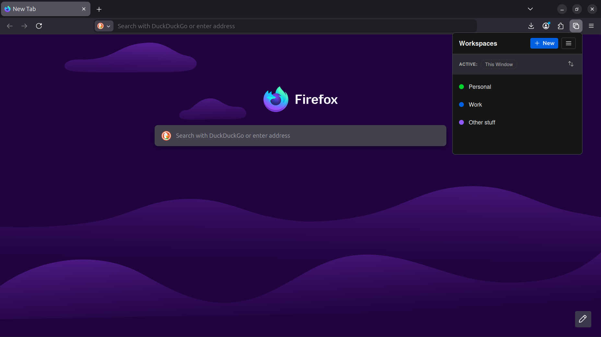
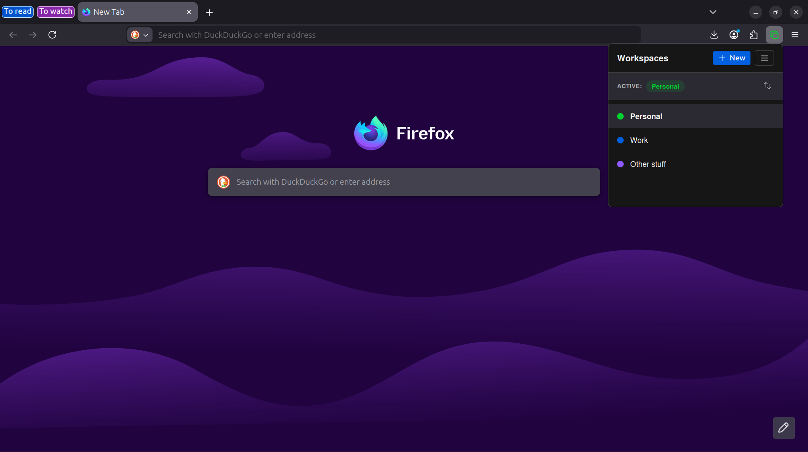
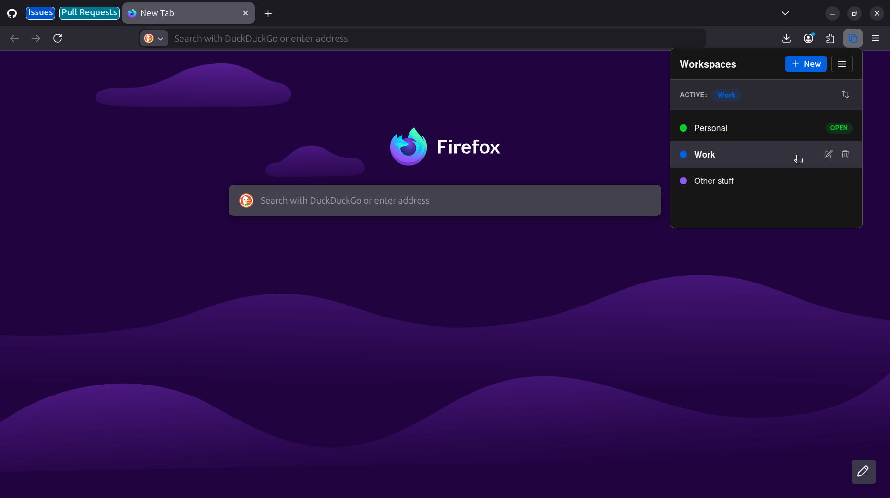
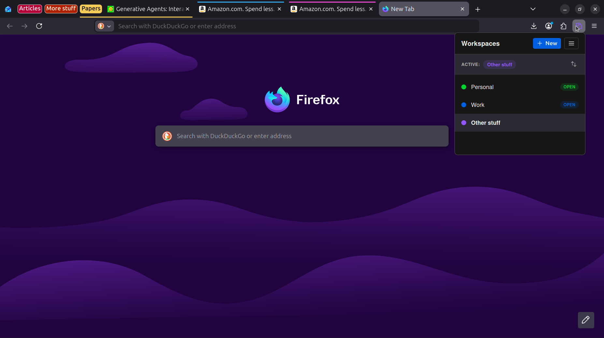

# Workspaces

A lightweight workspace manager for Firefox, inspired by the workspaces feature of Microslop Edge.

## 💡 Why this exists

This extension was made because even though I started to hate the AI slop built into Edge, this stupid browser has several features I like, and one I love is the way it handles workspaces in separate windows **keeping your project tabs organized and remembering exactly where you left off**, and I wanted to bring it somehow to Firefox so I can finally make the switch for good.

## 🛡️ Disclaimer

Yes, before you ask, this extension was made with Gemini's help. As a junior dev, I currently don't have the skills to create something at the same level as a professional, but I tried to use what I know with some help.

## ✨ Features

- **Isolated Workspaces:** Save groups of tabs and windows as separate workspaces.
- **Native Look & Feel:** Designed following the Mozilla Protocol system for a seamless integration with Firefox.
- **Persistent State:** Workspaces are automatically saved and restored exactly as you left them (tabs, pins, and groups).
- **High Performance:** Implements **Lazy Loading** (tab discarding) for near-instant restoration of windows with hundreds of tabs.
- **Dynamic Indicators:** The toolbar icon color changes dynamically to match the active workspace in each window.
- **Multi-Account Containers:** Native integration with [Firefox Containers](https://addons.mozilla.org/en-US/firefox/addon/multi-account-containers/) to keep your personal and professional contexts separated within the same workspace.
- **Explicit Reordering:** A dedicated reorder mode to organize your workspace list exactly how you want.
- **Backup & Restore:** Full destructive restoration support (legacy style) to keep your data safe and portable.
- **Dark Mode Support:** Automatic theme synchronization based on your system preferences.

And the best part:
- **Privacy First:** Works fully offline with no external tracking. Your data stays in your browser (future sync with Mozilla accounts is being considered).

## 📸 Screenshots

  
  

  
  

## 🚀 Installation (Development)

1. Clone this repository: `git clone https://github.com/jgalec/firefox-workspaces.git`
2. Open Firefox and go to `about:debugging`.
3. Click "This Firefox" and then "Load Temporary Add-on".
4. Select the `manifest.json` file from the project directory.

## 🎨 Design Principles

This extension is built with a deep focus on the [**Mozilla Protocol Color Fundamentals**](https://protocol.mozilla.org/docs/fundamentals/color). It uses:
- [**Heroicons**](https://heroicons.com/) for professional, scalable iconography.
- **CSS Masks** for dynamic, theme-aware icon styling.
- **Mozilla's Color Palette** for accessibility and visual harmony.

## 📄 Documentation

Detailed information can be found in the `docs/` folder:
- [Features Overview](docs/features.md)
- [Design Guidelines](docs/design-guidelines.md)
- [Technical Overview](docs/technical-overview.md)

## ⚖️ License

MIT License - feel free to use and contribute!